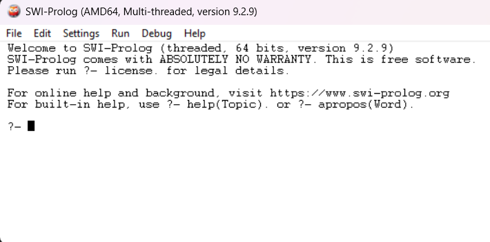

# Practica 4

## Instalación y ejemplos en el lenguaje de progamacion Prolog

### Introduccion

Prolog es un lenguaje de programación lógica, usado principalmente en inteligencia artificial y procesamiento de lenguaje natural. Se basa en hechos, reglas y consultas para resolver problemas mediante razonamiento lógico.

### Procedimiento

El alumno instalará el entorno de desarrollo para Prolog, explorará los fundamentos del paradigma lógico mediante la creación de hechos, reglas y consultas, y desarrollará aplicaciones que resuelvan problemas clásicos utilizando estructuras de datos, recursión y backtracking. Al finalizar, deberá documentar su trabajo en un reporte en PDF y subir tanto el código fuente como los archivos .pl funcionales al repositorio de la materia.

### Resultados

Como primer paso se verá la instalacion de prolog.

Siguiendo los pasos del profesor, entré a la pagina de prolog y descargue el instalador, despues de un rato configurandolo pude por fin poder acceder a al software.

El aprendizaje de Prolog implica un cambio profundo en la manera de concebir la programación. A diferencia de los lenguajes imperativos o funcionales, donde el programador indica paso a paso cómo debe ejecutarse una tarea, en Prolog se trabaja desde una perspectiva declarativa: se describe el conocimiento del problema en forma de hechos y reglas, y es el sistema quien se encarga de deducir las soluciones mediante razonamiento lógico. Esta diferencia obliga a pensar más en términos de relaciones y condiciones que en instrucciones secuenciales, lo cual transforma la forma en que se aborda la resolución de problemas.
